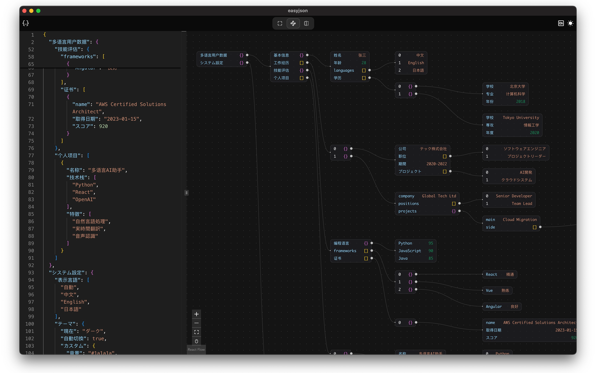
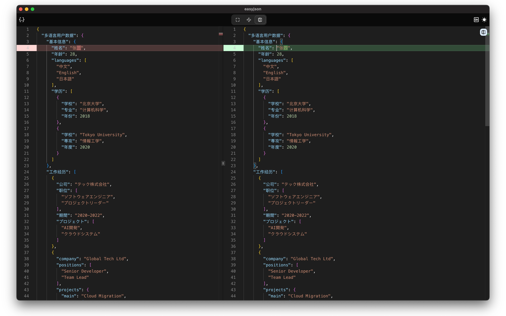
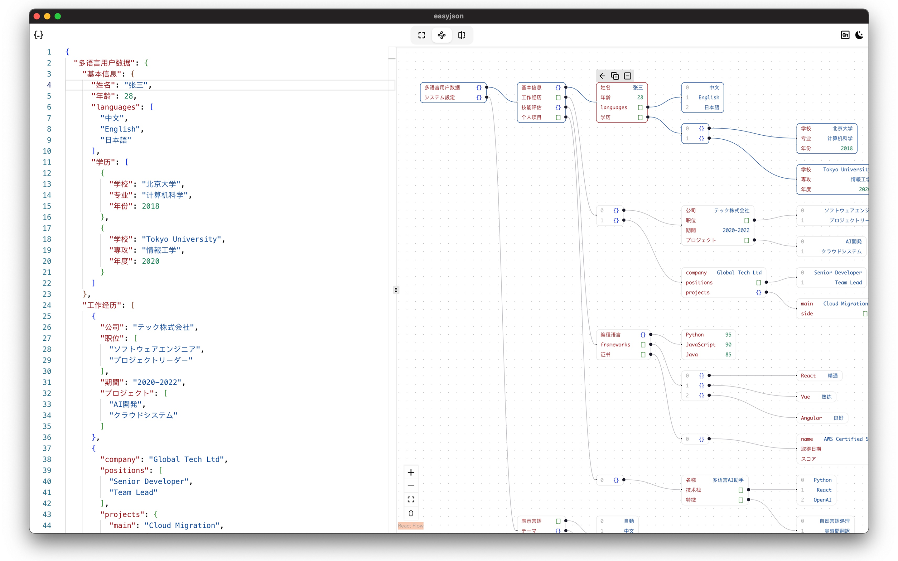

  

<h1 align="center">
easyJSON
</h1>

A desktop tool for visualizing JSON.

easyJSON is a encapsulated desktop version of <a href="https://github.com/loggerhead/json4u?tab=readme-ov-file">json4u</a>. I created this app because I couldn't find a beautiful and easy-to-use JSON visualization tool for Mac.

# Screenshots

  
  
  

# Features

To keep things focused and efficient, I've implemented the core features of json4u along with a few enhancements that I find particularly useful.

## Core Features

- [x] JSON visualization
- [x] JSON comparison
- [x] JSON formatting

## Additional Features

- [x] Automatically paste JSON from the clipboard
- [x] Global shortcut to open the app and paste JSON from the clipboard

# Download

| Platform | Download                                                                                                                                                                                                    |
| -------- | ----------------------------------------------------------------------------------------------------------------------------------------------------------------------------------------------------------- |
| Macos    |  |
| Windows  |  |
| Linux    |  |
